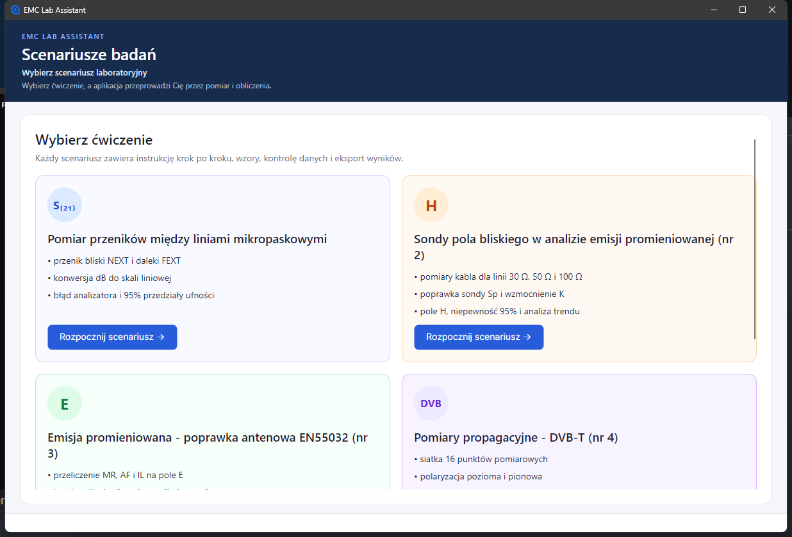
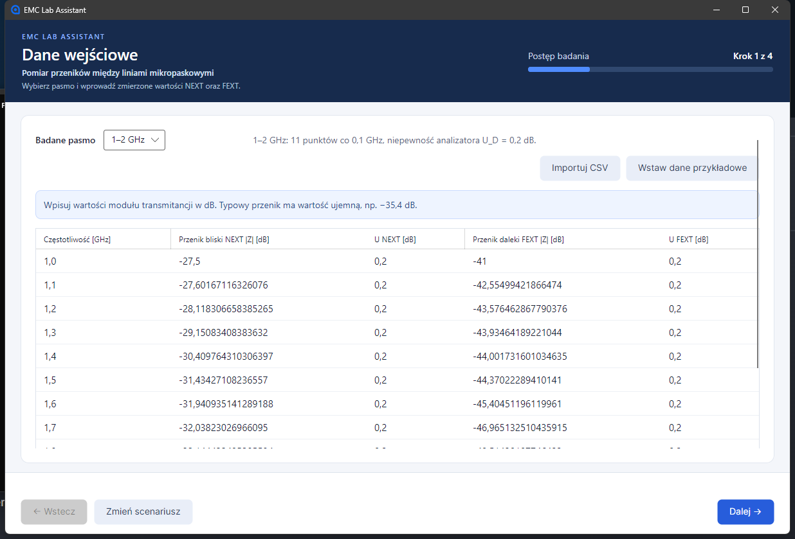
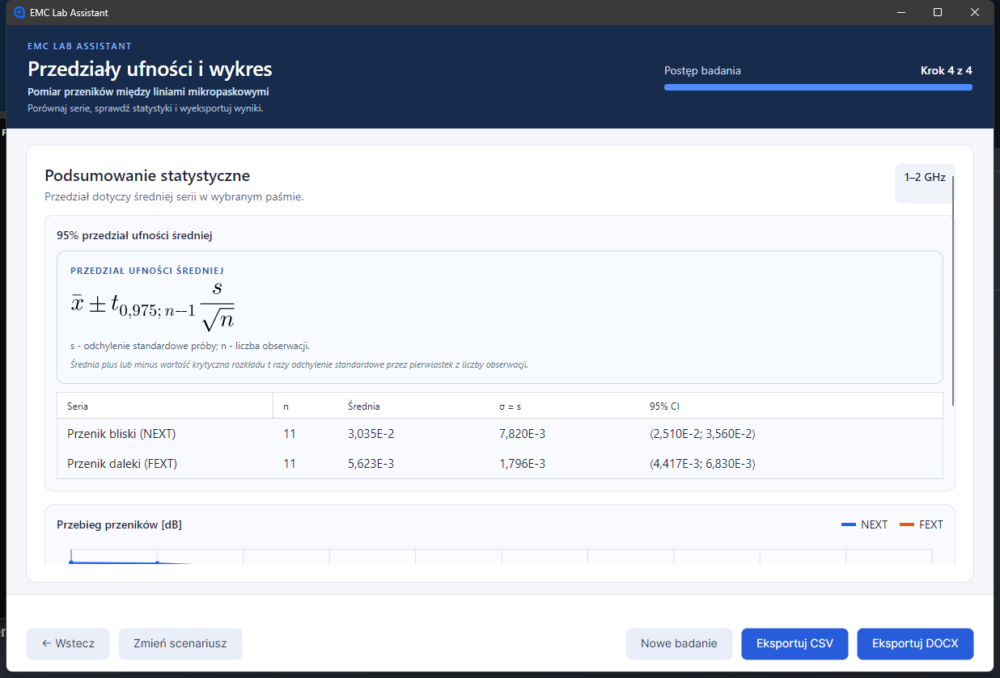
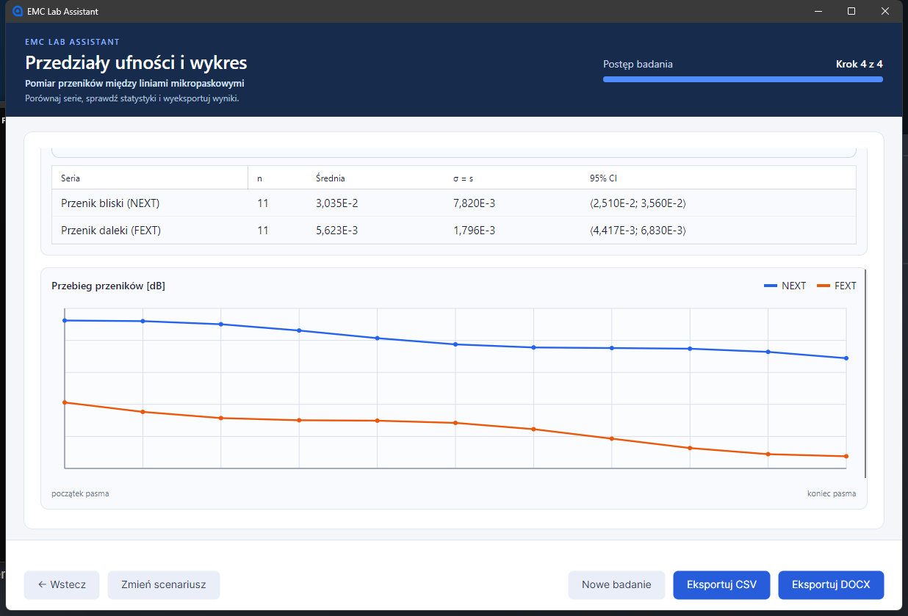

# EMC Lab Assistant

> Wieloplatformowy asystent laboratoriów kompatybilności elektromagnetycznej. Prowadzi przez pomiar, obliczenia, niepewność oraz przygotowanie wyników do sprawozdania.

| Pobieranie | Najprostszy start | Dokumentacja |
| --- | --- | --- |
| [Windows x64](https://github.com/haribo841/Electromagnetic-Compatibility/releases/download/v2.0.0/EMC_Lab_Assistant_Windows_x64.exe) | [3 kroki](#najprostszy-start) | [Instrukcja użytkowania](Documentation/Final/03_Instrukcja_uzytkowania_EMC_Lab_Assistant.docx) |
| [Linux x64](https://github.com/haribo841/Electromagnetic-Compatibility/releases/download/v2.0.0/EMC_Lab_Assistant_Linux_x64) | [Wydanie 2.0.0](https://github.com/haribo841/Electromagnetic-Compatibility/releases/tag/v2.0.0) | [Dokumentacja techniczna](Documentation/Final/01_Dokumentacja_techniczna_EMC_Lab_Assistant.docx) |

## Co oferuje aplikacja

EMC Lab Assistant jest desktopowym kreatorem do pracy na ćwiczeniach z kompatybilności elektromagnetycznej. Waliduje dane, prezentuje czytelnie sformatowane równania, oblicza niepewność i umożliwia eksport wyników.

- **Pomiar przeników między liniami mikropaskowymi** - NEXT/FEXT, konwersja dB, błąd analizatora, statystyka i przedziały ufności.
- **Sondy pola bliskiego** - pomiary kabla dla linii 30, 50 i 100 Ω, poprawka sondy, wzmocnienie, pole H oraz niepewność 95%.
- **Emisja promieniowana EN 55032** - korekcja antenowa, MR, AF i IL, polaryzacja, limit klasy B i margines zgodności.
- **Pomiary propagacyjne DVB-T** - siatka 16 punktów, obie polaryzacje, profile anteny, Eav ± T, wykres i mapy cieplne.
- **Nauka do egzaminu** - bloki tematyczne, pytania kontrolne i kalkulatory EMC.
- **Import i raportowanie** - CSV/TXT, pliki MATLAB w scenariuszu emisji oraz eksport wyników do CSV i DOCX.

## Najprostszy start

1. Pobierz pakiet dla [Windows x64](https://github.com/haribo841/Electromagnetic-Compatibility/releases/download/v2.0.0/EMC_Lab_Assistant_Windows_x64.exe) albo [Linux x64](https://github.com/haribo841/Electromagnetic-Compatibility/releases/download/v2.0.0/EMC_Lab_Assistant_Linux_x64).
2. W Windows uruchom plik <code>.exe</code>. W Linux nadaj plikowi prawo wykonywania i uruchom go:

   ~~~bash
   chmod +x EMC_Lab_Assistant_Linux_x64
   ./EMC_Lab_Assistant_Linux_x64
   ~~~

3. Wybierz scenariusz, wpisz lub zaimportuj dane pomiarowe i przejdź kolejne kroki kreatora. Na końcu wyeksportuj CSV albo DOCX.

## Wspierane platformy

| Środowisko | Status |
| --- | --- |
| Windows 10/11 x64 | gotowy samodzielny pakiet w wydaniu 2.0.0 |
| Linux x64 | gotowy samodzielny pakiet w wydaniu 2.0.0 |
| Windows 7 i 8.1 | nie są oficjalnie wspierane przez .NET 8 |
| Budowanie ze źródeł | .NET 8 SDK na Windows lub Linux |

## Przykład działania

Przykładowy przebieg badania przeników:

1. Wybierz pasmo 1-2 GHz i wstaw dane przykładowe lub zaimportuj CSV.
2. Przejdź przez przeliczenie do skali liniowej i wyznaczenie błędu analizatora.
3. Odczytaj 95% przedział ufności oraz wykres NEXT i FEXT.
4. Zapisz dane lub raport przyciskiem <code>Eksportuj CSV</code> albo <code>Eksportuj DOCX</code>.

## Zrzuty ekranu

  
  

  
  

## Architektura i przepływ pracy

  

Każdy kreator kończy się wynikiem gotowym do eksportu. Warstwa interfejsu Avalonia XAML komunikuje się z modelami widoku MVVM, modelami danych i usługami obliczeniowymi.

  

## Technologie

- C# i .NET 8
- Avalonia UI 12 oraz XAML dla Windows i Linux
- CommunityToolkit.Mvvm i architektura MVVM
- CSharpMath dla czytelnego składu równań
- DocumentFormat.OpenXml dla raportów DOCX
- MatFileHandler dla plików MATLAB

## Dokumentacja

- [Dokumentacja techniczna](Documentation/Final/01_Dokumentacja_techniczna_EMC_Lab_Assistant.docx)
- [Raport projektowy dla prowadzącego](Documentation/Final/02_Raport_projektowy_dla_prowadzacego.docx)
- [Instrukcja użytkowania](Documentation/Final/03_Instrukcja_uzytkowania_EMC_Lab_Assistant.docx)
- [Rejestr pokrycia materiału przedmiotu](Documentation/COURSE_COVERAGE.md)

## Budowanie ze źródeł

Wymagany jest .NET 8 SDK.

~~~powershell
dotnet restore CrosstalkAnalyzer.sln
dotnet build CrosstalkAnalyzer.sln -c Release
dotnet run --project CrosstalkAnalyzer.csproj
~~~

Testy obliczeń, importu, eksportu i nawigacji:

~~~powershell
dotnet run --project Tests/CrosstalkAnalyzer.CalculationChecks -c Release
dotnet run --project Tests/CrosstalkAnalyzer.UiTests -c Release
~~~

## Licencja i zgłoszenia

Projekt jest udostępniany na warunkach [licencji MIT](LICENSE).

Masz błąd, pomysł na scenariusz lub poprawę dokumentacji? [Otwórz zgłoszenie w GitHub Issues](https://github.com/haribo841/Electromagnetic-Compatibility/issues/new/choose).

## Archiwum opisu technicznego

Szczegółowy, wcześniejszy opis modułów, importu, eksportu oraz publikowania zachowano w [archiwum README z 6 września 2026 r.](Documentation/Archive/README_2026-09-06.md).
